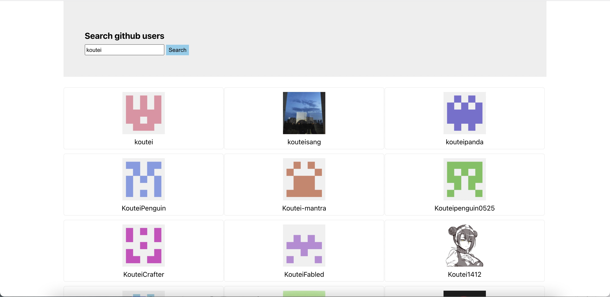

# Implement github search function using React

## api
```
GET https://api.github.com/search/users?q=xxx
```

## Parent-child component information transfer using PubSub-js

```
PubSub.publish('userdata', {users:response.data.items, isLoading:false, isFirstTime:false}) //发送消息
```
```
//接收消息
this.token = PubSub.subscribe('userdata',(msg, data)=>{
     this.setState({...data})
})
```

## Runtime Screenshot


